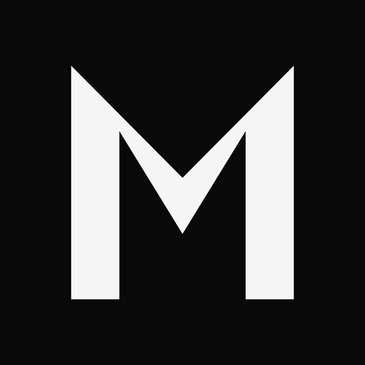
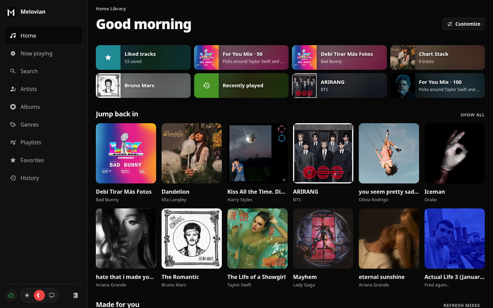
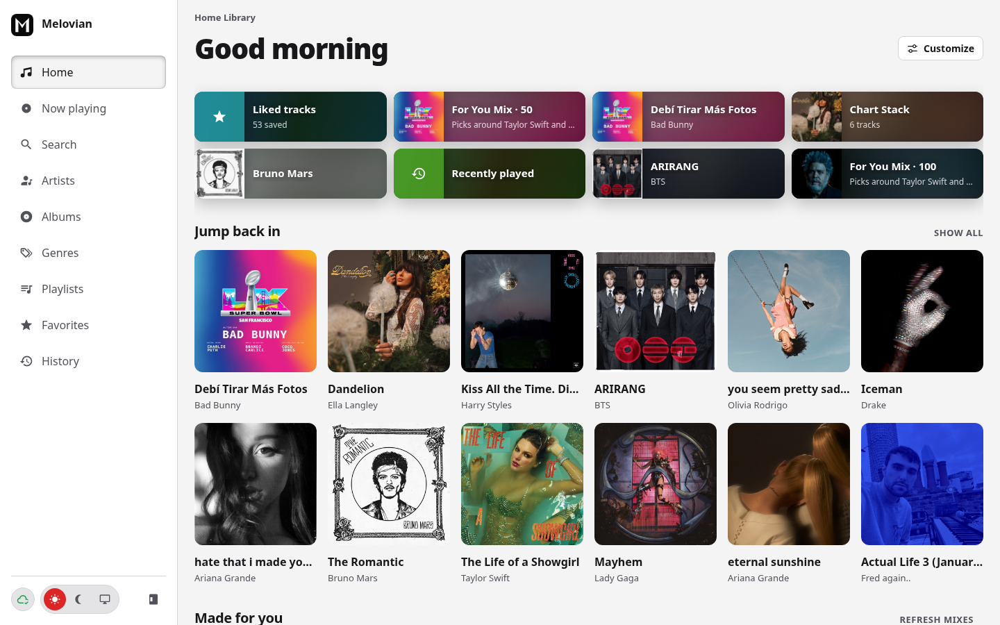

# Melovian

> [!WARNING]
> This project is still alpha level software and being actively developed.



Melovian plays music from a library you control. Connect [Navidrome](https://www.navidrome.org/) or any Subsonic-compatible server, or add folders on your computer and play everything in one app.

Desktop builds run on Linux, Windows, and macOS. You can also run it as a website with Docker. Stack: Go, Svelte 5, SQLite by default (Postgres via `MELOVIAN_DATABASE_URL`), [Wails v3](https://v3.wails.io/).

## Screenshots

<p>
  
  
</p>

More shots are in [`showcase/`](showcase/). Rebuild them with `task showcase`.

## What you need

| Tool | Notes |
|------|--------|
| [Go](https://go.dev/) 1.26+ | Backend and desktop shell |
| [Node.js](https://nodejs.org/) 22+ and [pnpm](https://pnpm.io/) 11 | Frontend (`pnpm` is pinned in `frontend/package.json`) |
| [Wails v3 CLI](https://v3.wails.io/getting-started/installation) | Desktop app and `wails3 dev` |
| [Task](https://taskfile.dev/) | Optional. Short commands below use it (same idea as Make) |
| Linux only | C compiler plus `libmpv`, GTK 4, and WebKitGTK **dev** packages for native desktop builds |

Full platform notes: [docs/en/requirements.md](docs/en/requirements.md).

## Run (development)

1. Copy the example env file:

   ```bash
   cp .env.example .env
   ```

2. Install frontend packages:

   ```bash
   cd frontend && pnpm install && cd ..
   ```

3. Start the desktop app with hot reload.

**With Task**

```bash
task dev
```

**Manual** (no Task installed)

```bash
wails3 dev -config ./build/config.yml -port 9245
```

On first launch, open **Settings -> Servers** and add a Subsonic server or a local music folder.

## Everyday commands

| Goal | With Task | Manual |
|------|-----------|--------|
| First-time setup | `task setup` | `cp .env.example .env` then `cd frontend && pnpm install` |
| List tasks | `task --list` | (Task only) |
| Dev desktop app | `task dev` | `wails3 dev -config ./build/config.yml -port 9245` |
| Dev server + Vite | `task dev:server` | Run `go build -tags server` binary and `pnpm --dir frontend dev` with `/api` proxy |
| Run tests | `task test` | `go test ./internal/... ./services/...` then `cd frontend && pnpm test` |
| Format / lint check | `task format:check` / `task lint` | `gofmt` + `cd frontend && pnpm format:check` / `pnpm lint` |
| Regenerate bindings | `task generate:bindings` | `wails3 generate bindings -clean=true -ts` |
| Typecheck frontend | `task check` | `cd frontend && pnpm check` |
| Build desktop binary | `task build` | See [Build](#build) below |
| Package installer / archive | `task package` | Prefer Task. Packaging is OS-specific under `build/` |
| Linux AppImage (bundled libmpv) | `task package:appimage` | Prefer Task |
| Server binary (no GUI) | `task build:server` | See [Build](#build) below |
| Run server binary | `task run:server` | `./bin/melovian-server` (after building it) |
| Docker image | `task build:docker` | See [Docker](#docker-web) below |
| Stop Docker stack | `task stop:docker` | `cd docker && docker compose down` |

## Build

**Desktop binary (Task)**

```bash
task build
```

**Desktop binary (manual, Linux example)**

Bindings and icons are usually already committed. Rebuild the UI, then compile with CGO:

```bash
cd frontend && pnpm install && pnpm run build && cd ..
CGO_ENABLED=1 go build -tags production -trimpath -buildvcs=false -ldflags="-w -s" -o bin/melovian
```

On Windows or macOS the same idea applies (`go build` with `-tags production`). Use Task if you want the full packaging path for your OS.

**Server binary (HTTP only, no window)**

```bash
# Task
task build:server

# Manual
cd frontend && pnpm install && pnpm run build && cd ..
go build -tags server -o bin/melovian-server
./bin/melovian-server
```

**Cross-compile server release binaries** (linux amd64/386/arm64/armv6/armv7/riscv64, freebsd, openbsd, netbsd, windows, darwin):

```bash
VERSION=v0.1.0 task build:server:cross
```

**Frontend zip** (SPA for same-origin hosting next to a server):

```bash
VERSION=v0.1.0 task package:frontend
```

**Static demo frontend** (dummy catalog, no Go server, for GH Pages):

```bash
task build:frontend:demo
# or:
# VITE_STATIC_DEMO=true VITE_BASE=/melovian/ pnpm --dir frontend run build
```

Enable GitHub Pages (source: GitHub Actions) to use `.github/workflows/pages.yml`. The workflow builds with `VITE_STATIC_DEMO=true` and deploys on pushes to `main`.

Release tags also ship desktop apps (Linux tar + AppImage, Windows zip, macOS universal), an Android APK, an ad-hoc iOS IPA for sideloading (resign with your Apple ID), and the archives above.

Client and server exchange version headers (`X-Melovian-Client-Version`, `X-Melovian-Server-Version`) and a capability list. Newer frontends hide unsupported features on older servers. Versions below the declared minimum show a blocking message.

More packaging options (Android, iOS, AppImage): [docs/en/build.md](docs/en/build.md).

## Docker (web)

Copy `.env` first. For a multi-user deploy, set `MELOVIAN_AUTH_SECRET` to a long random string (32+ characters). For a public read-only demo, set `MELOVIAN_DEMO_MODE=true` instead.

**With Task**

```bash
task build:docker
cd docker && docker compose up -d
```

**Manual**

```bash
cd frontend && pnpm install && pnpm run build && cd ..
docker build -t melovian:web -f docker/Dockerfile .
cd docker && docker compose --env-file ../.env up -d
```

**GHCR image** (built by CI on `master`, tags, and nightly)

```bash
docker pull ghcr.io/<owner>/melovian:latest
# or a release tag / nightly
docker pull ghcr.io/<owner>/melovian:v0.1.0
docker pull ghcr.io/<owner>/melovian:nightly
```

Open the site in your browser. Create an admin account at `/account/login` unless you are in demo mode.

Details: [docs/en/docker.md](docs/en/docker.md).

## Docs

Project docs at the repo root:

- [Changelog](CHANGELOG.md)
- [Contributing](CONTRIBUTING.md)
- [Security](SECURITY.md)
- [TODO](TODO.md)

Go dependencies live in [`vendor/`](vendor/). Refresh with `task go:vendor` after `go.mod` changes.

Guides under [`docs/en/`](docs/en/):

- [Features and platforms](docs/en/features.md)
- [Requirements](docs/en/requirements.md)
- [Getting started](docs/en/getting-started.md)
- [Build](docs/en/build.md)
- [Docker / web deploy](docs/en/docker.md)
- [Development](docs/en/development.md)
- [Configuration](docs/en/configuration.md)

## License

Copyright 2026 Quad4 Software.

Licensed under the Apache License, Version 2.0. See [LICENSE](LICENSE) for the full text.
